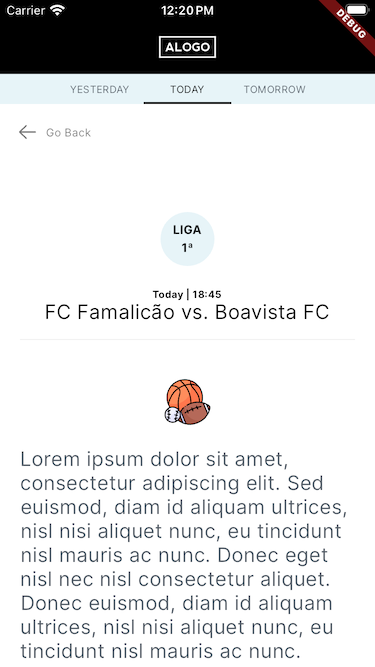
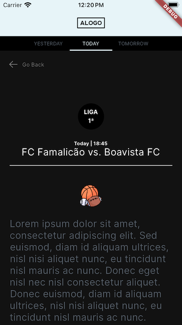

# Sports Event App

## Description

**Sports Event App** is a Flutter application designed to provide users with information about sports events based on local data. The app features two main pages. The first page displays a list of sports events, filtered according to the user's menu selection. The second page provides detailed information about a specific sports event, allowing users to delve deeper into match details.

## Screenshots

## Technical Specifications

- **Flutter version:** 3.13.1
- **Dart version:** Dart 3.1.0
- **Architecture:** Layered
- **State Management:** Provider

## Dependencies

The following external packages are utilized in the project:

- **flutter_svg:** ^2.0.9
- **provider:** ^6.1.1

## Additional Features

The Sports Event App incorporates the following additional features:

- **Light/Dark mode:** Color scheme alters according to the device's appearance.
- **Widget Tests:** Ensuring the correctness of individual widgets.
- **Unit Tests:** Validating the functionality of the underlying business logic.

## Getting Started

Follow these steps to get started with the Sports Event App:

1. Clone the repository to your local machine.
2. Ensure you have Flutter and Dart installed.
3. Run `flutter pub get` to install the required dependencies.
4. Launch the app on an emulator or physical device using `flutter run`.

Happy coding! 🚀
